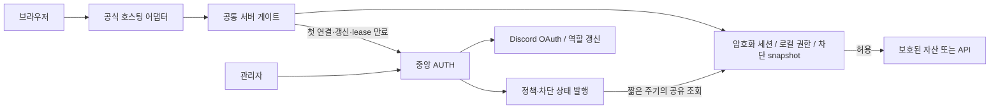

# NAKWOL AUTH 상용 운영 설계안

작성: 2026-09-30 / 상태: **검토용 제안, 미구현**

소스 기준: `4ca24da5e8a4dfd4867ad1f6b88725f1b0f59a40`(dev), Connect 0.7.1.
운영 검사 근거는 2026-09-29 기록이다. 이 문서 작성 중 운영 코드를 바꾸거나 재배포하지 않았다.
실행 계획: [단계별 개발 계획](../plans/2026-09-30-commercial-auth.md).

## 1. 결론과 사용자 의도

목표는 **각 개발자가 인증 로직을 만들지 않아도, 공식 SDK와 호스팅 어댑터 설치만으로 비인가자의 콘텐츠 전송을 차단하는 서비스**다. 로그인 편의성, 처리 속도, 비용, 관리자의 복구 능력도 제품 계약에 포함한다.

현재의 공통 게이트는 버릴 대상이 아니다. 로컬 AES-GCM 검증과 5분 authorization lease는 유지할 기반이다. 가장 큰 결손은 게이트 바깥의 공개 경로, 호스팅별 불완전한 설치, 인증/권한/세션의 수명 분리, 실제 조치 반영을 확인하는 운영 체계다.

권장 순서:

1. 공개 우회 경로와 설치 검증 결손을 먼저 막는다.
2. 중앙 SSO 격리와 OAuth 원자성 등 핵심 인증 계약을 보강한다.
3. 공식 어댑터와 버전 있는 정책 프로토콜을 제공한다.
4. 서버에서 조용히 세션을 갱신하고, 관리자 진단/복구를 제품화한다.
5. 짧은 차단 전파 채널을 별도로 검증한 뒤 상용 운영 프로필로 활성화한다.
6. 실제 브라우저 성능·비용·장애 훈련을 통과한 범위에만 정식 지원을 선언한다.

## 2. 보장 범위와 성립하지 않는 약속

### 반드시 보장할 것

- 콘텐츠를 보내기 전에 서버가 판정한다. HTML, JS/CSS, JSON, 이미지, 폰트, 동영상, 다운로드, API, HEAD, Range, 조건부 요청도 같다.
- 파일 확장자/공개 CDN/프리뷰 URL/이전 배포/원본 버킷을 통해 인증을 우회하지 못한다.
- 세션은 앱과 사이트 origin에 바인딩한다. A의 쿠키를 B에 복사해도 사용할 수 없다.
- `member`의 전역 기준은 시즌3 역할 `1553600098661957643`. 시즌1·2, Discord 관리자 역할로 대체하지 않는다.
- 앱별 임시 허가는 별도의 감사 가능한 예외이며 전역 member 자격을 바꾸지 않는다. 명시적 차단은 허가보다 우선한다.
- 중앙 통신 실패 시 유효한 기존 승인만 정해진 기한까지 사용한다. 기한이 지나면 503, 실패를 member로 바꾸지 않는다.
- 여러 사이트의 로그인은 중앙 SSO를 재사용하되 각 사이트의 접근 권한을 따로 검사한다.

### 한계를 숨기지 않을 것

- 인증된 사람이 이미 받은 파일, 스크린샷, 브라우저 메모리를 서버가 회수할 수는 없다. 이것은 다운로드 DRM 제품이 아니다.
- 다른 origin의 첫 방문은 쿠키를 공유하지 못하므로 중앙 SSO 왕복이 필요할 수 있다. 사용자의 로그인 버튼 재클릭은 줄일 수 있지만 모든 리다이렉트 자체를 없앨 수는 없다.
- **완전한 오프라인 로컬 승인, 0초 권한 회수, 중앙 장애 때 무제한 접속 유지**를 동시에 제공할 수 없다.
- 서버 게이트는 비공개 판정과 암호 연산 비용을 가진다. 비용 0/지연 0을 약속하지 않고 추가 비용·지연을 측정해 제한한다.
- 호스팅 소유자가 SDK를 빼거나 콘텐츠를 다른 곳에 공개하면 AUTH가 원격으로 막을 수 없다. 공식 설치/검증/운영 상태에 그 불일치를 드러내야 한다.

## 3. 현재 코드와 근거

아래 파일 경로는 저장소 루트 기준이다. 그래프 인덱스는 9월27일 세대이고 변경/미포함 경로가 있어 현재 파일을 직접 읽었다. 그래프 전체 검색 결과를 완전성 근거로 사용하지 않았다.

| 영역 | 확인한 현재 구현 | 평가 및 변경 방향 |
|---|---|---|
| 로컬 게이트 | `packages/connect-cli/src/server/gate.mjs`: AES-GCM, origin/client/policy 바인딩, lease 300초, 토큰/사이트 세션 최대 1시간 | 유지. 정책 버전·세션 ID·키 회전·서버 갱신 추가 |
| 동시 검증 | 같은 파일: isolate 내 pending 256, completed/revoked 각 512 제한 | 전역 단일 검증이 아님. 다중 isolate·캐시 축출·실패 폭주 측정 필요 |
| 정책 | `src/policy.ts`: 시즌3+추가 역할, 앱별 수동 허가, 역할 정보 24시간 유효 | 하드코딩 제거, 중앙 동적 정책/명시적 deny/기한부 grant 도입 |
| SSO 거부 | `src/index.ts`의 `/authorize`: `prompt=none` 접근 거부 시 중앙 세션 삭제 | B의 권한 부족이 A 로그인에 영향을 줄 수 있음. 앱 거부와 전역 인증 무효를 분리 |
| 토큰 | `src/store.ts`: 앱 토큰 1시간, 중앙 세션 idle 10일/absolute 30일 | 수명 자체를 늘리는 것보다 안전한 서버 갱신 필요 |
| OAuth 코드 | `exchangeAuthorizationCode`: SELECT 후 `used_at` 무조건 UPDATE와 INSERT를 batch | 동시 교환에서 중복 발급 가능성을 배제하는 원자적 조건이 보이지 않음. **소스상 위험, 동시 실행 재현은 아직 안 함** |
| Discord 갱신 | `src/discord.ts`: OAuth access token만 반환; 로그인에서 역할 읽음 | 봇 없이 가능. refresh token 보관/자동 역할 갱신은 이 경로에 없음 |
| 브라우저 SDK | v0.3.2→v0.3.1→v0.2.0 상속, 기본 sessionStorage 토큰, top-level `prompt=none` | 서버 보호 모드는 장기 토큰을 JS에 두지 않는 서버 콜백으로 이행 |
| 로그인 페이지 | `src/server/login.mjs`: SDK 동적 import 후 bootstrap→getMe→사이트 session→다시 me | 첫 연결의 중복 조회 축소. import 실패 시 버튼 동작 복구, authOrigin 정규화 |
| 설치기 | `protection.mjs`: Workers/Pages 정적 빌드만 공식 자동 설치. Vercel은 custom | Vercel 지원을 검증된 공식 어댑터로 올려 수작업 예외 제거 |
| 검사기 | `protection-verify.mjs`: 지정 인벤토리/주소, 401/403+헤더+no-store 판정, 응답 body 취소 | 상태 코드만으로 콘텐츠 부재 증명 불충분. body canary와 원본/이전 배포 조사 추가 |
| 운영 지원 | `src/access-support.ts`, migration 0013: grant/revoke/reauthenticate+사유+이력 | 이미 존재. revoke는 수동 허가 철회이며 역할 보유자의 접근 금지는 아님. expires_at과 전파 확인 없음 |
| 업데이트 | `managed-updates.mjs`, `release-check.mjs`, `gate-reports.ts` | exact lockfile, PR, 배포 검사, 선택적 CF 롤백 존재. 실제 설치·배포·중앙 보고를 혼동하지 않도록 확장 |
| 쓰기 API | gate GET/HEAD만 콘텐츠 허용 | POST/PUT 등을 안전하게 붙일 공식 서버 API 필요. 메서드 제한만 없애면 안 됨 |

### 운영 검사: 2026-09-29

- 가이드: 빌드 파일 768개, HTML 별칭 포함 844주소 × 4방식 = 각 3,376요청.
- Cloudflare: 콘텐츠 843주소 차단. `/version.json`만 공개.
- Vercel: 288파일 공개 = 이미지279 + JS5 + CSS1 + 아이콘2 + version1. 864개의 200과 288개의 206. 대표5파일은 원본 해시 일치, ETag 요청304.
- 원인: 외부 가이드 저장소 `middleware.js` matcher 예외 및 `vercel.json` 공개 캐시. **공통 게이트 새 버전 없이 해당 사이트 설정으로 바로잡을 수 있는 결함**.
- 덱 뷰어: 당시 설치 빌드 인벤토리 1,384요청 차단. 추가 URL 변형에서 콘텐츠 우회 미발견.
- 이 결과는 지난 검사 시점/해당 경로에 한정한다. 미열거한 과거 배포와 외부 원본까지 안전하다는 판정이 아니다.
- 재현 자료: 로컬 `.wrangler/gate-audit-detailed.md`, `audit-full-{cloudflare,vercel}.json`, `audit-body-proof.json`. ignored 자료만을 장기 근거로 삼지 말고 후속 CI에 익명화된 결과/인벤토리 해시를 보존한다.

### 성능 기준선

기존 Miniflare/workerd, AUTH 지연100ms, HTML1+JS4+CSS3+JSON4+이미지300, 동시6 요청 드라이버 결과:

| 항목 | lease 전 | 현재 lease 후 |
|---|---:|---:|
| 최초312요청의 `/me` | 53 | 0 |
| 요청 배치 완료 | 6,483ms | 1,045ms |
| 이미지 평균 TTFB | 119.1ms | 17.8ms |
| 조건부 재방문 배치 | 6,453ms | 563ms |
| lease 만료 후 동시300 | 별도 비교 안 함 | 동일 isolate `/me` 1회 |

이 값은 운영 CDN·실제 브라우저 LCP·전체 이미지 원본 크기를 측정한 값이 아니다. workerAuthWallMean은 CPU 시간이 아니다. 로컬 결과로 상용 성능 달성을 선언하지 않는다.

## 4. 선택한 구조와 대안

| 구조 | 장점 | 비용/한계 | 결정 |
|---|---|---|---|
| 모든 자산에서 중앙 AUTH 조회 | 중앙 판정 반영 빠름 | RTT/장애 의존/트래픽이 자산 수에 비례 | 제외 |
| 각 사이트 공식 서버 SDK + 중앙 정책/SSO | 콘텐츠 hot path 로컬, 호스팅 독립, 기존 투자 활용 | 최초 어댑터 설치/업데이트 필요 | **기본 구조** |
| 모든 콘텐츠를 중앙 리버스 프록시로 이동 | 중앙에서 배포·차단 관리 용이 | 대역폭·장애 집중, 원본 사설화/도메인 이전 필요 | 별도 호스팅 상품일 때만 검토 |



### 책임 분리

- 중앙 AUTH: 신원, 시즌 역할, 앱 소유권, 정책 결정, 세션 발급/회수, 감사 기록.
- 공통 서버 SDK: 요청 승인/거부, 암호화, 자동 갱신, 캐시/오류/복귀 처리. 정책 엔진 복제 금지.
- 공식 어댑터: **모든 콘텐츠 진입점**에 게이트 연결. framework rewrite/API/image optimizer도 인벤토리에 포함.
- 설치/업데이트 CLI: 최소 구성 생성, 기존 CI 병합안, 배포된 버전과 보호 범위 확인.
- 브라우저 SDK: 상태 표시/사용자 조작. 브라우저 저장값은 서버 승인 근거가 아니다.
- 개발자는 clientId, origin, 빌드 산출물, 플랫폼만 지정. OAuth/쿠키/권한 로직 작성 불필요.

## 5. 완전한 보호 설치 계약

1. 기본은 deny-all. 공개 경로는 별도 `publicPaths`에 정확한 경로·사유·자료 등급을 명시. 보호 제품에서는 자료가 포함된 wildcard 공개 예외 금지.
2. 로그인·콜백·SDK 로딩 등 인증에 필요한 최소 bootstrap만 공개. 보호 앱 bundle을 로그인 화면이 먼저 가져오지 않는다.
3. Workers는 `run_worker_first:true`, Pages는 `include:['/*'],exclude:[]`와 fail-closed 호스팅 설정 확인.
4. Vercel static 어댑터는 전 경로 matcher. `next()`의 최종 캐시/스트림 헤더는 실제 배포에서 확인. 인증 후 내부 CDN 캐시가 있어도 외부로 나가는 모든 응답은 먼저 게이트를 통과해야 한다.
5. Vercel Next/SSR/API는 static과 별도 지원 대상으로 둔다. Next data/RSC/prefetch/image optimization/route handler 경로까지 합격 전에는 공식 지원으로 표시하지 않는다.
6. API나 R2/S3의 원본 주소는 직접 공개하지 않는다. 비공개 바인딩/인증된 원본 호출 사용. 서명 다운로드 URL은 전달 가능한 bearer라는 별도 계약이며 기본 보호 우회 대안으로 쓰지 않는다.
7. 기본 URL, 커스텀 도메인, 프리뷰, 이전 배포, 소스 저장소의 자료 공개 여부를 등록한다. API 권한 없이 발견 못한 항목은 `미확인`, 삭제/폐쇄 확인은 `폐쇄`로 표시한다.
8. protect verify는 빌드 manifest 해시+배포 ID+origin에 묶인다. 헤더의 runtimeVersion은 관측값일 뿐 소스 진위 증명이 아니다.
9. 검사: 2xx 노출, 401 body 속 canary, 304 무인증, redirect 최종 대상, 외부 원본, CDN hit/miss, Range, 도메인/헤더 변형. redirect 루프/503/404를 차단 성공으로 바꾸지 않는다.
10. 중앙에서 URL을 검사한다면 앱 소유 검증·HTTPS·DNS 재검증·private/link-local/metadata IP 차단·redirect마다 동일 검사·크기/시간 제한을 적용한다. 관리자 입력 URL도 SSRF 예외가 아니다.

## 6. 정책·세션·역할 수명

### 제안 기본값과 안전 범위

아래는 새 설계의 **제안값**이다. 기존 운영값을 변경한 사실이 아니다.

| 항목 | 기본 | 설정 범위 | 적용 단위 |
|---|---:|---:|---|
| 권한 lease | 300초 | 60~300초 | 전역 기본+앱별 더 짧은 값 |
| 앱 access token | 60분 | 10~60분 | 앱 |
| 사이트 세션 idle / absolute | 10일 / 30일 | 1시간~10일 / 1~30일, idle≤absolute | 전역 상한+앱 강화 |
| 중앙 SSO idle / absolute | 10일 / 30일 | 동일 상한 | AUTH 운영자 |
| Discord 역할 정보 최대 나이 | 15분 | 5~60분 | 전역 상한, 자동 갱신 지원 이후 활성화 |
| 수동 허가 만료 | 1시간 | 5분~7일 | 해당 앱/사용자, 사유 필수 |
| 운영 차단 snapshot freshness | 30초 | 정식 1차는 고정 | bounded-control 프로필 |

5분 넘는 lease는 현재 기준보다 회수 지연을 늘리므로 초기 UI에서 제공하지 않는다. 시간 단위를 분/일로 명확히 표시하고 무제한 토큰 옵션을 만들지 않는다. refresh token, access token, Discord 역할 나이, 로그인 유지 기간을 하나의 '토큰 만료일'로 합치지 않는다.

### 정책 프로토콜 v1

새 서버 전용 인증 응답은 다음과 동등한 정보를 반환한다. 기존 `/me` 소비자는 기존 필드를 유지한다.

```json
{
  "schemaVersion": 1,
  "policyVersion": 42,
  "clientId": "app-id",
  "siteOrigin": "https://service.example",
  "subject": "opaque-user-id",
  "sessionId": "opaque-session-id",
  "decision": "allow",
  "source": "role",
  "verifiedAt": 1900000000000,
  "leaseUntil": 1900000300000,
  "sessionExpiresAt": 1900003600000,
  "membershipValidUntil": 1900000900000,
  "capabilities": ["policy-v1", "server-refresh-v1", "control-v1"]
}
```

시각은 Unix milliseconds로 통일. leaseUntil은 검증 시작시각+lease, access/session/역할/수동허가 만료 중 최솟값이다. 지연된 응답 수신시각으로 연장하지 않는다. 서버가 발급한 응답만 AEAD 쿠키에 봉인한다. 브라우저의 allowed/role/TTL 값은 입력으로 받지 않는다.

중앙이 정책 판정의 권위자다. 로컬에는 immutable client/origin binding과 안전 상한만 둔다. `member`→`guest` 전환은 보안 완화이므로 운영자 검토·미리보기·감사 후 정책 버전을 증가시킨다. 기존 런타임에 적용되었다고 표시하지 않는다.

기간을 늘릴 때 이미 만료된 토큰은 부활하지 않는다. 기간을 줄일 때 기존 쿠키의 만료 필드를 소급 편집할 수는 없으므로 정책 버전/차단 채널로 재평가한다. 관리자 화면에 신규 발급 적용과 기존 세션의 최대 반영 시점을 함께 표시한다.

## 7. 빠른 차단과 로컬 성능의 양립

### 두 운영 프로필을 구분

- `local-lease`: 현재와 같은 순수 로컬 승인. 유효 lease 중 중앙 호출0. 운영자 차단 반영 최대300초. 중앙 장애 내성은 남은 lease까지. 이 프로필을 '즉시 차단'이라고 표시하지 않는다.
- `bounded-control`: 상용 권장 후보. `/me` lease는300초를 유지하되 앱 단위 차단 snapshot을 isolate 메모리에 최대30초 보관한다. 유효 snapshot+lease면 자산 요청은 로컬만 처리한다. 최초 isolate/30초 만료 때만 snapshot 조회, 동시 요청은 합친다. **유효 lease가 있어도 콜드 시작에 제어 통신1회가 추가된다.** 따라서 기존 '유효 lease면 모든 네트워크0'보다 강화된 회수와 추가 비용을 교환한다.

bounded-control은 성능 합격 전 기존 사이트의 기본값으로 강제 전환하지 않는다. 즉시 전파를 위해 모든 자산에서 D1/KV/R2를 읽는 구현은 금지한다.

### 제어 채널 설계

- 앱별 Durable Object를 후보 조정자로 사용한다. 공개 API는 플랫폼 중립 HTTPS이며 타 사이트는 Cloudflare 바인딩을 직접 요구하지 않는다. 대역폭은 콘텐츠가 아니라 작은 제어 문서에 한정한다.
- snapshot: monotonic version, application status, policy minimum version, 발행시각/만료, 유효 lease 기간 동안 필요한 session/user 폐기 식별자. PII 원문과 OAuth 토큰 제외, 등록된 site credential로만 조회.
- 응답은 고정 만료를 가진 서명 문서. 중앙 공개키 kid를 pin/회전하고 origin/client/audience를 확인. 캐시에서 오래된 문서를 재서명하거나 수신시각부터 TTL을 다시 시작하지 않는다.
- 차단 정보 폭증 시 최대64KiB 이내로 유지하고 app epoch를 올려 기존 lease 전부 재검증. bloom filter만으로 접근 허용하지 않는다. 정상 사용자에게 생기는 일회성 재검증 비용을 측정한다.
- 조치 처리: DB 감사/정책 변경+outbox → 제어 상태 발행 → `published` 기록 → 게이트 관측. 원자적 분산 트랜잭션으로 가장하지 않는다. 발행 실패는 pending/failed로 남기고 작업 ID로 재시도한다.
- freshness 경과 후 snapshot 조회 실패는503. 이전 lease만으로 계속 승인하지 않는다. 이 선택 때문에 bounded-control은 중앙 제어 장애에 더 민감하다.
- 차단 시각의 성능/안전 계약: **published 이후30초+허용 clock skew5초 안에 시작하는 새 요청부터 차단**. 응답 직전 승인 시점도 명시. 진행 중 스트림과 이미 전송된 자료는 별도이며 완료된 다운로드를 회수한다고 주장하지 않는다.
- 관리자 버튼 접수와 전파 완료는 다르다. 네트워크 분할/오래된 런타임에는 전파 완료를 표시하지 않고, 호스팅 emergency maintenance 설정을 별도 복구 수단으로 둔다.

유효한 쿠키가 없는 요청은 제어 snapshot을 가져오기 전에 거부한다. 공격자가 임의 쿠키를 대량 전송해 중앙 제어 조회를 유발하지 못하게 한다. 갱신·제어 endpoint에는 credential/app별 rate limit, 요청 크기 제한, 실패 backoff와 bounded negative cache를 두되 명시적 사용자 재시도가 오래된 실패에 갇히지 않도록 상한을 둔다. isolate 수가 늘면 공유 조회도 늘므로 '사이트 전체30초당1회'라고 광고하지 않는다.

정말 0초 회수/장시간 스트림 강제 종료가 필요한 서비스는 온라인 요청별 검사 또는 중앙 프록시가 필요하다. 이것을 기본 정적 SDK의 무비용 기능으로 약속하지 않는다.

## 8. 사용자 불편을 줄이는 서버 인증

### 목표 흐름

1. A에서 로그인 완료. B 첫 방문 시 B 세션은 없으므로 서버가 중앙 `/authorize?prompt=none`으로 이동한다.
2. 중앙 SSO와 B권한이 유효하면 Discord 화면 없이 B의 서버 콜백으로 일회성 code를 보낸다.
3. 공통 서버 SDK가 PKCE 검증·code 교환·서버 세션 생성 후 저장한 경로/쿼리/해시로 복귀한다.
4. 같은 사이트 재방문은 쿠키만 검증. access token 만료는 서버 refresh로 처리하고 사용자에게 로그인 화면을 띄우지 않는다.
5. 중앙 SSO 절대 만료, 사용자의 동의 철회, 관리자 재인증 강제 등 실제 필요한 경우에만 로그인 안내한다.

### 서버 갱신 보안

- 브라우저 JS에 장기 refresh token을 주지 않는다. 사이트 전용 키로 암호화한 HttpOnly 쿠키 또는 서버 저장소를 사용하며 서버 키가 포함된 번들 배포는 검사에서 실패시킨다.
- 앱/사이트별 confidential credential을 발급한다. Discord secret이나 중앙 운영자 키를 각 사이트에 배포하지 않는다.
- 중앙은 refresh token 해시/family/세대/만료/revocation을 관리한다. 토큰 회전과 재사용 감지, 앱/origin binding을 적용한다.
- 여러 탭·300동시 요청·isolate 간 갱신 경합을 정상 공격으로 오인하지 않도록 short-lived idempotency key와 중앙 CAS/암호화된 재전송 결과를 설계한다. 서로 다른 재사용은 family 폐기. 응답 유실 시에도 한 번만 회전된 동일 결과를 제한 시간 내 재사용한다.
- 동일 site 세션을 다른 브라우저가 복제했을 때 범위를 줄이되 IP고정/과도한 기기 지문으로 정상 사용자를 막지 않는다.
- refresh가 전역 SSO 로그아웃/차단을 우회하지 않도록 중앙 session family에 종속시킨다. 별도 '이 사이트 로그아웃'과 '전체 서비스 로그아웃'을 명시한다.
- callback은 CSRF state, PKCE, 브라우저 transaction cookie, 정확한 redirect URI, code 일회성 원자 소비를 검증한다. return URL은 같은 origin 상대경로만, 외부 redirect 금지. callback HTML/API에는 no-store와 Referrer-Policy를 적용한다.
- 여러 탭 transaction을 구분하고 만료/상한을 둔다. 콜백이 원래 경로를 덮어쓰지 않는다. 해시는 HTTP로 오지 않으므로 링크 SDK/최소 bootstrap이 sessionStorage에 저장하고 성공 후 한 번 복원한다.

### SSO와 오류 상태

- B에 역할이 없으면 B의 앱 세션만 거부한다. A의 유효 로그인과 중앙 신원을 삭제하지 않는다.
- 전역 사용자 비활성/세션 폐기 때만 중앙 로그인도 무효화한다.
- UI 상태: checking → connected / login-required / permission-denied / temporarily-unavailable / cookie-blocked. 검사 전 permission-denied 문구나 로그인 버튼이 깜빡이지 않는다.
- 진행이250ms 미만이면 화면 전환을 추가하지 않고, 더 길면 '접속 확인 중…' 하나만 표시. 무한 spinner 대신8초에 재시도/지원 코드 제공.
- SDK 로드 실패, 차단된 storage, 여러 탭, Safari/모바일 webview, 팝업 제한을 테스트한다. 숨은 iframe의 third-party cookie 성공에 의존하지 않는다.

## 9. 봇 없는 역할 갱신

현재24시간 역할 정보 정책을 곧바로15분 강제 재로그인으로 바꾸면 요구사항을 위반한다. 먼저 **중앙에서만** Discord OAuth access/refresh token을 암호화 보관하고 자동 갱신 기능을 구현한다.

- 동의 scope는 기존 identify/guilds.members.read부터 검토. 중앙에서 받은 expires_in/refresh token을 보존하되 로그·사이트·브라우저로 전달하지 않는다.
- 사용자 단위로 역할 조회를 합친다. 여러 앱에서 같은 사용자가 이동해도 Discord 조회를 앱 수만큼 반복하지 않는다.
- freshness 경계 전 active 사용자에 한해 갱신하고, 휴면 사용자는 접근 시 갱신한다. 별도 사용자 식별로 조회가 가능한 봇을 로그인 필수로 만들지 않는다.
- 429 Retry-After/일시 장애/invalid_grant/서버 탈퇴/역할 제거를 구분한다. 조회 오류를 역할 없음으로 DB에 덮어쓰지 않는다. 마지막 정상 결과와 확인 실패를 별도로 보관한다.
- 역할 증거가 hard expiry를 넘으면 차단. 정상 조회 성공이면 사용자의 재로그인 없이 갱신. invalid_grant만 재동의 안내.
- 새 세션의 lease는 membershipValidUntil을 넘지 않는다. 이로써 새 프로토콜의 역할 제거 반영 상한은 역할 freshness+clock skew이며, 기존 24시간+5분과 구분된다. Discord 응답 자체의 지연은 별도 의존성이다.
- 기존 사용자에게 refresh credential이 없으면 다음 정상 로그인에서 수집한다. 전환일까지 legacy24시간 프로필로 표시하고 silent renewal 지원을 허위 표시하지 않는다.
- 선택적 Discord 이벤트 봇은 후속 보완 기능이다. 연결 끊김/이벤트 누락 시 OAuth 정기 조회가 근거이며 봇 없이도 기본 기능을 사용할 수 있다.

## 10. 관리자 운영 콘솔

### 사용자×서비스 진단

Discord ID/지원 코드로 조회해 아래 정보를 한 화면에서 보여 준다.

- 중앙 계정/사이트/앱 상태, 마지막 로그인/역할 확인, 실제 정책 버전, 부족한 역할, 수동 허가/차단 사유와 만료.
- 중앙 세션/앱 토큰/사이트 세션 구분, 지원되는 범위의 관측값과 마지막 관측시각. 모든 사용자 세션이 온라인인 것처럼 표시하지 않는다.
- 현재 설치/운영 runtime, 정책/제어 채널 capability, 보호 인벤토리 범위, 미확인 origin, 가장 최근 검증 실패.
- 같은 사용자도 서비스별 결정이 다를 수 있음을 설명. 역할 freshness 실패와 실제 역할 없음, 설정 오류, upstream 장애를 구분한다.

### 조치

| 조치 | 구현 계약 |
|---|---|
| 역할 다시 확인 | 중앙 credential이 있으면 즉시 재조회. 없으면 사용자 재동의 링크. 관리자 입력만으로 Discord 역할을 조작하지 않음 |
| 임시 접근 허가 | 앱·사용자·만료·사유. 전역 member/admin 부여 불가. explicit deny와 비활성 상태 우회 불가 |
| 명시적 차단/해제 | 역할 보유 여부와 무관한 app/global deny. 수동 허가 철회와 별도 버튼 |
| 사이트 세션 종료 | 지정 session/family 회수. 필요 이상으로 전 사이트 로그아웃시키지 않음 |
| 전체 로그아웃/재인증 | 전체 session family 회수, 다음 실제 로그인 요구 |
| 정책 미리보기/되돌리기 | 영향 대상 수와 익명화된 판정 차이, 저장 version CAS, 되돌리기도 새 버전으로 감사 |
| 서비스 잠금 | maintenance deny 상태. '장애 해결'을 이유로 전체 공개 전환 금지 |
| 보호 검사/업데이트 | 등록 배포의 검사와 인증된 CI 실행 요청. 호스팅 권한 미등록 시 단계·담당자 명확히 표시 |

모든 조치에 actor, target, scope, reason, before/after, operationId, created/published/observed/deadline 상태를 기록한다. 승인·실패·부분전파를 구분하며 버튼 성공만으로 복구 완료를 표시하지 않는다.

현재 `/me`는 상세 판정 대신 일반 `ACCESS_DENIED`를 반환한다. 새 서버 프로토콜에서는 안정적인 reason code와 support trace ID를 제공하고, 사용자용 설명과 운영자용 상세 진단을 분리한다. trace ID만 안다고 다른 사용자의 이벤트나 역할 목록을 조회할 수 있어서는 안 된다.

AUTH 운영자와 서비스 개발자 권한을 분리한다. 운영자는 전역 정책/강제 조치, 개발자는 소유 앱의 상태/제한된 진단만. 민감 조치는 최근 재인증을 요구하고 last-operator lockout을 막는다.

### 관리자 자신이 잠겼을 때

일반 사이트 member 정책과 운영자 인증을 분리한다. 중앙 정책 오류가 운영 콘솔까지 막지 않게 독립 복구 경로를 마련한다. 일회성 복구 자격증명은 hash 보관·짧은 만료·소모성·감사·rate limit을 적용하고, 성공해도 자료 사이트 전체를 공개하지 않는다. AUTH 자체 장애 때는 제한된 Cloudflare/GitHub 운영 자격증명으로 검증된 이전 배포를 복원하는 runbook을 둔다. 콘솔 장애 중 콘솔 버튼만 복구 수단으로 제시하지 않는다.

## 11. 성능·캐시·비용 계약

### 목표(SLO 후보, 측정 전 달성 주장 금지)

- warm 유효 승인 이미지300: `/me`0, 자산별D1/KV/R2 0. bounded-control의 유효 snapshot 동안 제어 요청0.
- 같은 isolate 동시 만료300: `/me`1. 다중 isolate 수와 제어/갱신 요청 수를 함께 기록하며 전역1회라고 보고하지 않는다.
- 통제된 동일 장비에서 로컬 인증 CPU p95≤2ms 목표, 추가 TTFB p95≤10ms 목표. CPU와 wall-clock을 별도 측정한다.
- 같은 호스팅의 테스트 전용 공개 fixture 대비 warm300자산 배치: 추가 시간 max(100ms,10%) 이내 목표. 운영 데이터를 공개해 기준선을 만들지 않는다.
- 같은 지역 실브라우저 A→B 자동 SSO p95≤1.5초 목표(Discord 화면 제외). 네트워크·기기·중앙지연별 분포 별도 보고.
- 조건부 재방문은 변경 없는 자산 body 전송0을 목표로 한다. 요청 수는 남는다. 이미지 lazy loading은 각 사이트 선택 기능이지 게이트 누락의 대안이 아니다.
- 내부 로그인 성공률99.9%, 30일 정상 토큰/세션 요청의 AUTH5xx 0.1% 미만을 초기 운영 목표로 두되 Discord/클라이언트 취소/권한 거부를 따로 집계한다.

### 캐시

거부·콜백·토큰·개인 JSON은 no-store. 공통 정적 파일은 인증 후 private,no-cache + ETag/304. positive max-age/immutable은 기본 보호 파일에 부여하지 않는다. logout 전 저장한 화면/브라우저 캐시를 강제로 회수한다고 주장하지 않는다.

보호된 내부 CDN 원본 캐시는 가능하지만 요청 입구에 인증이 항상 선행해야 한다. key에는 배포/경로를 포함하고 사용자별 응답은 공유하지 않는다. Vary만으로 캐시 격리나 인증을 대신하지 않는다. 서비스워커가 네트워크 없이 보호 파일을 반환하는 경로도 공식 검증에 포함한다.

### 용량/비용

대략 N자산×P페이지 방문이면 게이트 호출도 N×P다. lease는 중앙 AUTH 호출을 줄이지 사이트 Worker 호출 자체를 제거하지 않는다. P=1,000,N=312라면 자산요청312,000회가 기준이다. provider별 청구 단가를 고정해 문서에 박지 말고 검사 시점의 요금/한도와 지역/콜드스타트 비율을 기록한다.

AUTH 비용은 활성 session 수/lease, Discord는 활성 사용자 수/freshness, 제어 문서는 활성 isolate 수/30초에 주로 비례한다. 각 항목을 따로 계측한다. 과금 한도를 넘으면 공개로 전환하지 않는다. quota 경고와 증설/호스팅 전환 선택을 제공한다.

기본 보안 시험은 작은 고정 fixture로 빠르게 수행하되 성능 시험은 실제 크기 분포를 반영한다. 작은 이미지300개만으로 이미지가 많은 사이트의 전송량·디코딩 성능을 대표하지 않는다. 신규 인프라의 예상 비용과 기존 계정 한도를 먼저 제출하고, 유료 플랜 전환이나 구독 구매는 이 계획에 자동 포함하지 않는다.

## 12. 운영 품질과 업데이트

- 단일 코드의 generated Worker/공식 어댑터를 생성한다. 사이트별 복붙 OAuth 구현 금지.
- 런타임은 exact dependency+lockfile+검증된 CI. 중앙 설정은 데이터로 내려주며 원격 JS eval/임의 hot code 교체 금지.
- 최초 새 프로토콜을 적용하는 1회 사이트 배포는 필요하다. 이후 지원된 정책/시간 변경은 재빌드 없이 전파. 버그 수정·새 호스팅 기능은 계속 버전 업데이트 대상이다.
- managed PR/검증 기능은 기존 구현을 확장한다. 등록되지 않은 개발자 사이트를 자동 배포하거나 호스팅 secret을 중앙에 무조건 요구하지 않는다.
- 공식 지원 runtime은 capability matrix로 관리. N/N-1 호환 기간은 최소90일 제안, 보안상 차단이 필요한 버전은 사유/기한/호환 경로를 공지한다. 무조건 무기한 지원 약속 금지.
- 배포는 dev→main→stable. additive DB migration, 구버전 읽기 지원→신버전 canary→운영 확인→후속 제거 순서. 이미 노출된 이전 배포를 rollback 정상본으로 쓰지 않는다.
- 로그는 이미지마다 중앙 기록하지 않는다. 인증 실패/관리 조치/전이 상태는 보존, 정상 자산은 집계·샘플링. 개인정보·토큰·원문 자료·쿼리의 민감값은 제외.
- 초기 보존 제안: 진단 이벤트30일, 관리자 감사180일, 만료 credential즉시 또는 정리 job까지 최소 보관. 삭제/백업/복구 테스트 포함.
- 정상 로그인/차단/권한 제거/5xx/키 회전/관리자 lockout/롤백을 synthetic fixture와 실제 두 계정으로 검증한다. 운영자 계정 하나의 성공으로 일반 사용자 검증을 대신하지 않는다.

## 13. 정식 출시 조건과 제외 범위

정식 v1은 Workers/Pages/Vercel static의 **인증된 어댑터**에 한정한다. 미지원 Netlify/Next SSR 등을 범용 Web API라는 이유만으로 인증 완료로 표시하지 않는다. API 보호 공통 hook은 제공하되 해당 서비스의 데이터 소유권 검사는 별도 계약이다.

필수 통과: 콘텐츠 비노출, 일반 시즌3/비멤버/차단 사용자, A→B SSO, lease/토큰/역할 경계, 다중 탭/다중 isolate, 정책 전환, 임시허가 만료, 키 회전, 중앙/Discord 장애, 비용 상한, 관리 복구, 이전 배포 우회, canary rollback.

현재 공통 gate 유지+검증 강화가 우선이다. JWТ 전면 전환, 모든 사이트 중앙 프록시, 필수 봇, 모든 이미지 DB 조회, 전체 공개 임시 버튼, 별도 덱/즐겨찾기 제품 개발은 이 계획의 기본 범위가 아니다.

## 14. 외부 설계 근거

- Cloudflare의 worker-first 라우팅은 정적 자산보다 인증 코드를 먼저 실행하는 설정이다. [공식 문서](https://developers.cloudflare.com/workers/static-assets/routing/worker-script/)
- Vercel Routing Middleware는 캐시 전 요청 처리 계층이다. matcher와 실제 응답 헤더를 함께 검증해야 한다는 설계 근거다. [공식 문서](https://vercel.com/docs/routing-middleware)
- Discord OAuth는 refresh token과 guilds.members.read를 제공한다. 중앙 자동 갱신 제안은 이 기능에 기반하며 현재 제품 구현 완료를 뜻하지 않는다. [공식 문서](https://docs.discord.com/developers/topics/oauth2)
- 토큰 회전·재사용·redirect/PKCE 위협 모델의 기준. [OAuth 2.0 Security BCP RFC 9700](https://www.rfc-editor.org/rfc/rfc9700.html)
- Durable Object는 앱별 제어 상태를 조정할 후보이며 추가 성능/비용 검증을 전제로 한다. [공식 문서](https://developers.cloudflare.com/durable-objects/concepts/what-are-durable-objects/)
